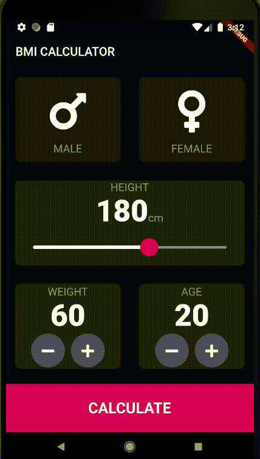

# BMI App

This simple Flutter app shows the BMI based on a person's height and weight.

Body Mass Index (BMI) is a person's weight in kilograms divided by the square of height in meters. 
A high BMI can be an indicator of high body fatness.

